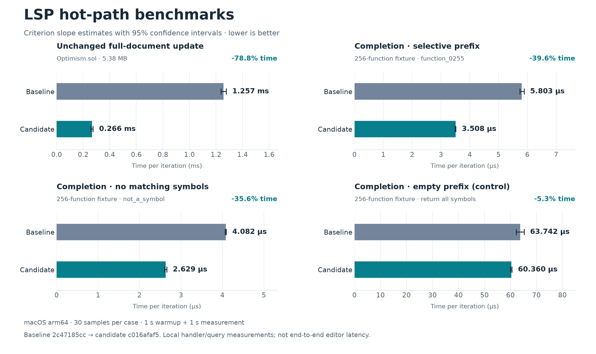

# LSP request benchmark evidence

Official main: `2c47185cc78101db0caf776bbc27f6fe8bae4a70`.
Candidate: `c016afaf5d92f18664c14baf4a506e145b86372e`.

The baseline and candidate ran sequentially in the same checkout on macOS
arm64 with Cargo's bench profile, 30 samples, 1 second warmup, and 1 second
requested measurement time per case. `run-metadata.json` records commands,
Git revisions, Rust version and host. The logs retain actual sample counts
and measurement windows.

The figure uses Criterion's slope estimates and 95% confidence intervals.
These are local notification-handler and symbol-query measurements. The
unchanged update benchmark also includes destruction of its prepared state.
They do not measure editor transport or scheduler latency. Empty-prefix
completion is included as a control; the path-index reuse change is not
independently timed in this comparison.

Raw estimates and samples are preserved at their original paths below
`target/criterion/`. `benchmark-evidence.json` records SHA-256 hashes of the
source files used for the chart. The plotting script is retained at
`target/lsp-pr-publish-20260911/plot-benchmarks.py`.

